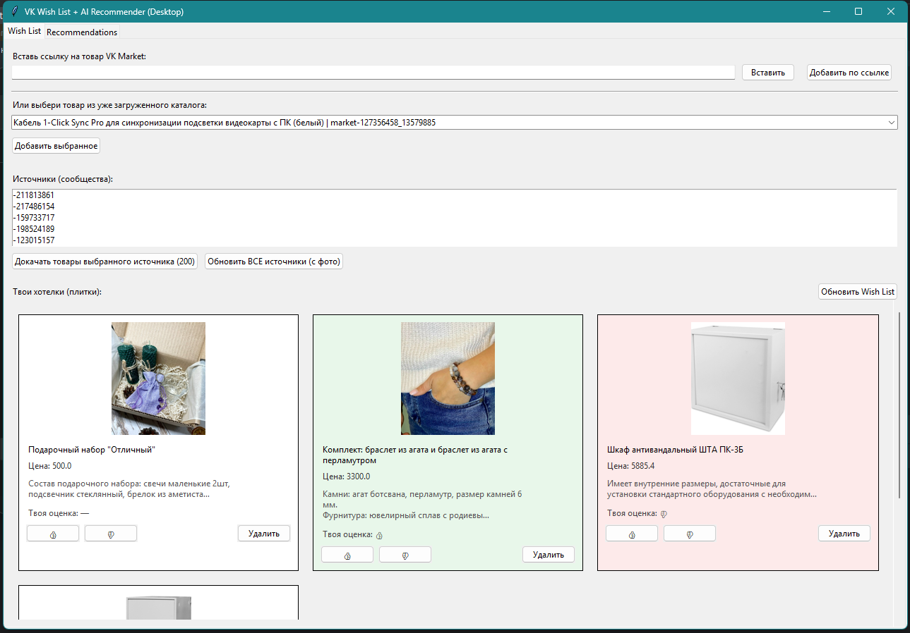
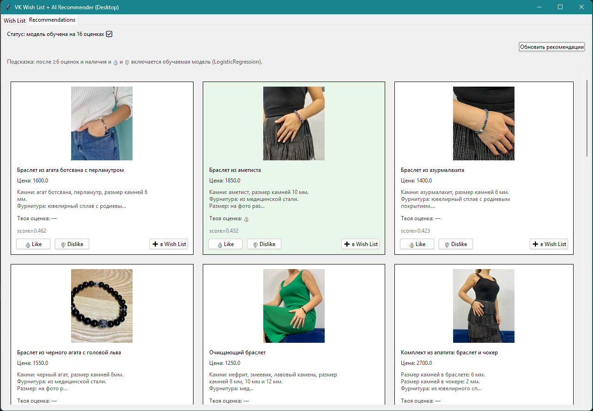

# Wish List с ИИ — рекомендательная система товаров во ВКонтакте (VK Market)

Прототип (НИР/курсовая работа): настольное приложение, в котором пользователь формирует **Wish List** товаров из **VK Market** и получает **персональные рекомендации**. Система не только “считает похожесть”, но и **обучается по обратной связи** пользователя (👍/👎), улучшая ранжирование рекомендаций.

---

## Скриншоты





---

## Идея проекта

Пользователь добавляет товары во вкладку **Wish List** (по ссылке на товар VK Market).  
Во вкладке **Recommendations** приложение предлагает похожие товары и позволяет ставить оценки **Like/Dislike**. На основе оценок система **переобучает модель** и персонализирует рекомендации.

---

## Основной функционал

### 1) Добавление товаров в Wish List
- Добавление товара **по ссылке VK Market** вида `vk.com/market-OWNERID_ITEMID`.
- Из ссылки автоматически извлекаются `owner_id` и `id`.
- Если товар из **нового сообщества**, приложение:
  - добавляет сообщество в `sources.csv`,
  - подкачивает товары этого сообщества через VK API в общий каталог (`products.csv`).

### 2) Автоматическое пополнение каталога товаров
- Каталог товаров хранится в `products.csv`.
- Для каждого товара сохраняются атрибуты:
  - `owner_id`, `id`, `title`, `description`, `price`, `url`, `photo_url`.
- Есть механизм обновления источников: повторная подкачка товаров выполняет “upsert” (обновляет старые записи и подтягивает фото/описание/цену).

### 3) Рекомендации + обучение модели
Рекомендации строятся в два этапа (гибрид):

**Этап A — контентная похожесть (база):**
- берётся текст товара (`title + description`);
- строится TF-IDF представление;
- профиль пользователя = средний TF-IDF вектор товаров из Wish List;
- кандидаты ранжируются по **cosine similarity**.

**Этап B — обучаемая персонализация:**
- пользователь ставит 👍 / 👎 на карточках;
- оценки сохраняются в `feedback.csv`;
- при накоплении достаточного числа оценок (и есть и лайки, и дизлайки) обучается модель **Logistic Regression**;
- итоговый рейтинг — смесь похожести и вероятности “понравится” от модели.

### 4) Интерфейс (desktop)
- Приложение на **Tkinter**.
- Две вкладки: **Wish List** и **Recommendations**.
- Товары отображаются **плитками**:
  - фото,
  - цена,
  - краткое описание,
  - кнопки управления.
- Карточки подсвечиваются по оценке:
  - зелёный — 👍,
  - красный — 👎.

---

## Технологии

- **Python**
- GUI: **Tkinter**
- ML: **scikit-learn** (TF-IDF, cosine similarity, LogisticRegression)
- Работа с данными: **pandas**, **numpy**
- Изображения: **Pillow**
- Данные товаров: **VK API (market.*)**

---

## Структура данных (файлы проекта)

- `products.csv` — каталог товаров (датасет)
- `sources.csv` — список сообществ-источников (owner_id)
- `wishlist.csv` — товары, добавленные пользователем в Wish List
- `feedback.csv` — оценки пользователя (label: 1 — 👍, 0 — 👎)
- `token.txt` — VK access_token (хранить локально, не коммитить!)

---

## Как запустить

### 1) Установить зависимости
```bash
pip install pandas numpy scikit-learn requests pillow
```
### 2) Добавить VK токен

Создай файл token.txt в корне проекта и вставь туда VK access_token с правами:
market
groups

### 3) Запуск приложения
python desktop_app.py
Ограничения

## Наиболее стабильно работают ссылки на товары сообществ формата:

vk.com/market-OWNERID_ITEMID

Ссылки типа vk.com/market/product/... могут быть витринными/агрегированными: VK API не всегда отдаёт по ним полную карточку.

### Идеи для развития

Метрики качества рекомендаций (Precision@K / Recall@K).

Дополнительные признаки: категории, ценовые диапазоны, бренды.

Семантические эмбеддинги вместо TF-IDF.

Хранение в БД (SQLite/PostgreSQL) вместо CSV.

Вариант интеграции в VK Mini Apps (как следующий этап).
